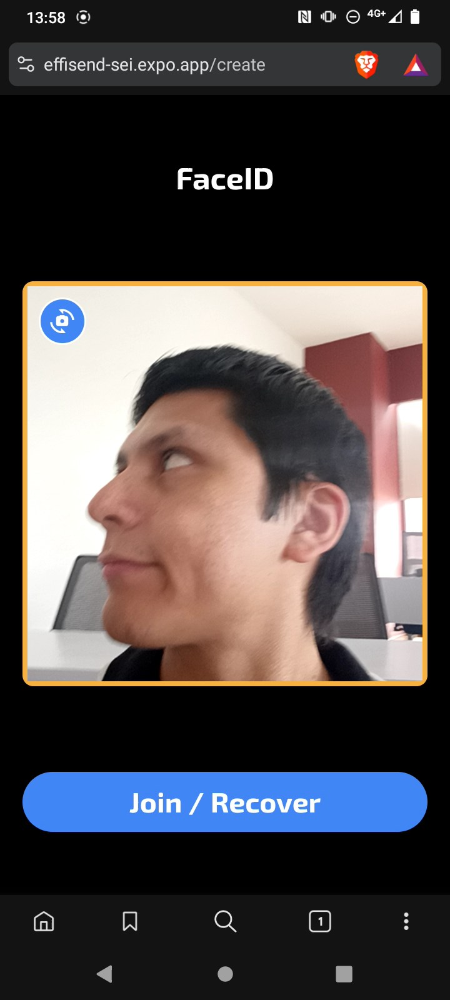

# EffiSend-Sei

<p align="center">

<p>

EffiSend reimagines digital payments by combining the security of biometric authentication with the convenience of conversational AI. Built on the **Sei** blockchain, our platform makes crypto transactions as simple as showing your face or having a chat with our AI assistant, DeSmond. We're not just processing payments—we're building a trust-based ecosystem where your verified identity becomes your gateway to seamless financial interactions and meaningful rewards.

## 🔗 Fast Links

  - **WEB DAPP:** [LINK](https://effisend-sei.expo.app/)
  - **VIDEO DEMO:** [LINK](pending....)

## ⚙️ System Architecture & Tech Stack

We've designed EffiSend with a modern Web3 architecture that prioritizes what matters most: speed, security, and simplicity. Every component works together to create an experience that feels familiar yet powered by cutting-edge blockchain technology.


*(The system diagram illustrates how the EffiSend frontend and backend services interact with the Sei network. The USDC token is shown as the primary asset for rewards and payments.)*

### sei Components:

  - [**Sei**](https://www.sei.io/)
    Our blockchain of choice for its lightning-fast transaction speeds and minimal fees. Sei's architecture perfectly matches our vision of making crypto payments feel instant and affordable, whether you're buying coffee or sending money across the globe.

  - [**USDC**](https://www.circle.com/en/usdc)
    We chose USDC as our primary currency because stability matters when you're dealing with real money. No one wants to worry about price volatility when splitting a dinner bill or earning rewards for platform activity.

  - [**Langchain (AI Agent)**](https://www.langchain.com/)
    The brain behind DeSmond, our conversational AI assistant. Instead of navigating complex interfaces, users can simply tell DeSmond what they want to do—"send $50 to Alice" or "check my balance"—and it handles the rest.

  - [**DeepFace**](https://viso.ai/computer-vision/deepface/)
    The technology that makes our Face-ID system both secure and user-friendly. With built-in anti-spoofing protection, you can trust that only you can access your wallet—no passwords to remember, no keys to lose.

## 🤳 FaceID

EffiSend enables seamless and secure payments through facial recognition and linking a user’s unique biometric profile directly to their wallet.

  

Behind the scenes, our Face-ID system works through an elegant two-step process:

1.  **`fetchOrSave`:** This function first attempts to find an existing user via facial recognition. If no match is found, it securely saves the new user's facial embedding, linking it to their new account.
2.  **`fetch`:** This function is used for subsequent logins and transaction authorizations, performing a search-only operation to retrieve user data upon a successful facial match.

This biometric system is isolated from other services to ensure maximum security.

#### User Verification Snippet

  - Fetch or Save:

<!-- end list -->

```python
@app.post("/fetchOrSave", dependencies=[Depends(check_api_key)])
async def findUser(item: ItemUserFace):
    try:
        result = DeepFace.find(
            img_path=item.image,
            db_path=DB_DIR,
            anti_spoofing=True
        )
        # Simplified result parsing
        return {"result": result[0].identity[0]}
    except Exception:
        # Save new user image
        save_image(item.image, item.nonce)
        return {"result": True}
```

  - Fetch:

<!-- end list -->

```python
@app.post("/fetch", dependencies=[Depends(check_api_key)])
async def findUser(item: ItemUserFace):
    try:
        result = DeepFace.find(
            img_path=item.image,
            db_path=DB_DIR,
            anti_spoofing=True
        )
        # Simplified result parsing
        return {"result": result[0].identity[0]}
    except Exception:
        return {"result": False}
```

## ⚡ Parallel Engine

Our BatchBalances contract demonstrates a best practice for improving UI performance by fetching multiple token balances in parallel, taking advantage of Sei's parallelization capabilities.

```solidity
// SPDX-License-Identifier: GPL-3.0
pragma solidity ^0.8.23;

import {ERC20} from "@openzeppelin/contracts/token/ERC20/ERC20.sol";

contract BatchBalances {
    // Get balances for multiple tokens in one call
    function batchBalanceOf(address _owner, address[] memory _tokenAddresses)
        public view returns (uint256[] memory) {
        uint256[] memory balances = new uint256[](_tokenAddresses.length);
        for (uint256 i = 0; i < _tokenAddresses.length; i++) {
            balances[i] = ERC20(_tokenAddresses[i]).balanceOf(_owner);
        }
        return balances;
    }

    // Get decimals for multiple tokens in one call
    function batchDecimals(address[] memory _tokenAddresses)
        public view returns (uint256[] memory) {
        uint256[] memory decimals = new uint256[](_tokenAddresses.length);
        for (uint256 i = 0; i < _tokenAddresses.length; i++) {
            decimals[i] = ERC20(_tokenAddresses[i]).decimals();
        }
        return decimals;
    }

    // Get allowances for multiple tokens in one call
    function batchAllowanceOf(address _owner, address _spender, address[] memory _tokenAddresses) 
        public view returns (uint256[] memory) {
        uint256[] memory allowances = new uint256[](_tokenAddresses.length);
        for (uint256 i = 0; i < _tokenAddresses.length; i++) {
            allowances[i] = ERC20(_tokenAddresses[i]).allowance(_owner, _spender);
        }
        return allowances;
    }
}
```

Instead of making separate calls for each token balance, this contract batches multiple queries into a single transaction. This reduces network overhead and creates faster, more responsive user interfaces—especially important when EffiSend needs to quickly show your complete portfolio.

All technical implementations for this module are included here.

  - [**Batch Balances**](./contract/batchbalances.sol)

## 💳 Payments:

We've streamlined the payment experience around **USDC** because predictable value matters in everyday transactions. Whether you're a merchant accepting payments or a customer making purchases, you shouldn't have to worry about price swings affecting your transaction.

  - The merchant or user initiates a payment request. Afterward, the customer’s QR code—similar to Alipay—or facial recognition is scanned. Once verified, the system displays the available tokens, allowing the user to proceed with the payment.

      

  - Every transaction generates a permanent record on the blockchain and a digital receipt for your records. Need proof of payment? It's all there, verifiable and tamper-proof, with the option to print or email receipts for traditional record-keeping.

      

### Crypto Payment Main Code

```javascript
const wallet = new Wallet(privateKey, provider);
let transaction;
if (req.body.token === 0) {
  transaction = {
    to: req.body.destination,
    value: parseEther(req.body.amount)
  }
} else {
  const interface = new Interface(abiERC20);
  const data = interface.encodeFunctionData("transfer", [
    req.body.destination,
    parseUnits(
      req.body.amount,
      tokens[req.body.token].decimals
    ),
  ]);
  transaction = {
    to: tokens[req.body.token].address,
    data
  }
}
const result = await wallet.sendTransaction(transaction);
```

All technical implementations for this module are included here.

  - [**Fetch Account**](./sei-functions/sei-fetch-or-create.js)
  - [**Execute Payment**](./sei-functions/sei-execute.js)

## 🎁 Rewards

EffiSend’s identity-based rewards model encourages platform engagement. Users earn **USDC** tokens for completing a certain number of transactions or actions, fostering a vibrant and active community.

  

Your **Trust Score** grows with your on-chain reputation. We analyze your transaction patterns and community involvement on Sei to identify engaged, trustworthy users. Higher trust scores unlock better rewards and personalized recommendations—it's like a credit score, but for the decentralized world.

### New Account Snippet.

```javascript
const wallet = Wallet.createRandom();
let dataframe = {
    privateKey: wallet.privateKey,
    address : wallet.address,
    user,
    rewards:"0.01"
}
await Accounts.doc(user).set(dataframe);
```

### Reward Snippet.

```javascript
const { rewards, user } = query.docs[0].data();
if (rewards <= 0) {
    throw "NO REWARDS"
}
const tx = await contract.transfer(_address, parseUnits(rewards, 6));
const dataFrameTemp = query.docs[0].data();
const dataframe = {
    ...dataFrameTemp,
    rewards: "0"
}
await Accounts.doc(user).set(dataframe);
```

All technical implementations for this module are included here.

  - [**Create or Fetch Account**](./sei-functions/sei-fetch-or-create.js)
  - [**Claim Rewards**](./sei-functions/sei-claim.js)

## 🔄 Swap Tokens

EffiSend integrates with Li.Fi to provide seamless token swapping directly within the platform. Users can easily exchange between different tokens on Sei—whether converting SEI to USDC for payments or diversifying their portfolio across supported assets.

Our swap functionality supports major tokens on Sei including SEI, USDC, USDT, etc... The system automatically handles token approvals when needed and provides real-time quotes to ensure users get the best rates available.

### Key Features:

- **Automatic Routing**: Li.Fi finds the most efficient swap routes
- **Smart Approvals**: Handles ERC20 token approvals automatically  
- **Real-time Quotes**: Always shows current market rates
- **Transaction Tracking**: Full visibility with Sei explorer links

### Swap Process Snippet:

```javascript
// Get quote for token swap
const quote = await getQuote({
  fromChain: chainId,
  toChain: chainId,
  fromAmount: parseUnits(amount, tokenFrom.decimals),
  fromToken: tokenFrom.address,
  toToken: tokenTo.address,
  fromAddress: userAddress,
  toAddress: userAddress
});

// Execute the swap
const route = convertQuoteToRoute(quote);
const tx = await wallet.sendTransaction(route.steps[0].transactionRequest);
```

All technical implementations for this module are included here.

  - [**Swap Tokens**](./sei-functions/sei-swap-tokens.js)

## 🤖 AI Agent (DeSmond)

Meet **DeSmond**, your personal crypto assistant who speaks human, not blockchain jargon. Built with **Langchain**, DeSmond turns complex wallet operations into simple conversations. Just tell him what you want to do with your money, and he'll handle the technical details.

  

### Agent Tools & Capabilities

DeSmond is smart enough to understand context and intent, then choose the right action for your request. Here's what he can help you with:

  - **`transfer_tokens`**: Facilitates token transfers on the Sei Mainnet.
  - **`swap_tokens`**: Enables users to exchange one token for another on Sei using Li.Fi's routing.
  - **`get_balance_sei`**: Retrieves a user's current token balance on Sei.
  - **`list_of_tools`**: Informs the user about DeSmond's capabilities.
  - **`fallback`**: Provides a friendly, conversational response when a user's intent is unclear.

All technical implementations for this module are included here.

  - [**Agent Code Snippets**](./agent/index.js)
  - [**Swap Tokens**](./sei-functions/sei-swap-tokens.js)

### Special Methods:

DeSmond also bridges the gap between crypto and traditional spending through MetaMask Card integration. When you want to load your MetaMask Card with USDC, just ask—he'll handle the conversion and transfer seamlessly.


  - **`fund_metamask_card`**: Enables the user to fund their MetaMask card.

<!-- end list -->

```javascript
const fundMetaMaskCard = tool(
  async ({ amount, to }, { configurable: { user } }) => {
    const response = await fetchURL(process.env.TOP_UP_PAYMENT_API, {
      user,
      amount,
      to,
    });
    console.log(response);
    if (response === null) {
      return JSON.stringify({
        status: "error",
        message: "Transaction failed.",
      });
    }
    const { hash } = response;
    return JSON.stringify({
      status: "success",
      message: "Transaction created and available on your MetaMask Card.",
      transaction: hash,
    });
  },
  {
    name: "fund_metamask_card",
    description:
      "This tool facilitates transfers where the specified amount is in USD, but the sending token is USDC on the Sei Mainnet. It generates transaction data for the user to sign and activates when the user explicitly opts to send USD to a MetaMask Card or mentions relevant terms such as 'transfer,' 'USDC,' 'Sei Mainnet,' or 'MetaMask Card' in the context of wallet activity.",
    schema: z.object({
      amount: z.string(),
      to: z.string(),
    }),
  }
);
```

### Agent Code Snippets

All technical implementations for this module are included here.

  - [**Agent Code Snippets**](./agent/index.js)
  - [**Fund MetaMask Card**](./sei-functions/sei-usdc-linea.js)